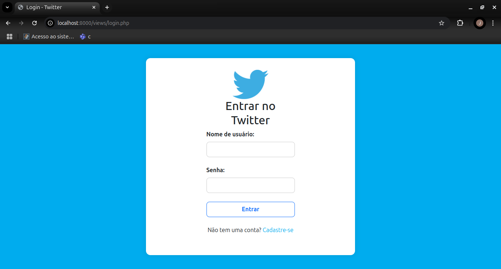

# Projeto Rede Social - Sistema de Login

## Descrição

Este projeto foi desenvolvido como parte do método de avaliação da disciplina **SW2 (Sistemas Web)**, no curso Técnico em Informática para Internet, realizado em 2023. O objetivo foi criar um sistema de login para uma rede social, utilizando **PHP** para o back-end e **MySQL** para o banco de dados, com **HTML** e **CSS** para o front-end. O **Twitter** foi usado como exemplo de rede social.

O sistema inclui funcionalidades de login, cadastro, e gerenciamento de sessão, com interface web e armazenamento de dados em banco de dados.

## Funcionalidades

- **Tela de Login**: Permite que usuários se autentiquem para acessar a rede social.
- **Tela de Cadastro**: Usuários podem criar uma conta fornecendo informações pessoais, como nome, e-mail, senha, telefone e data de nascimento.
- **Gerenciamento de Sessão**: O sistema mantém o usuário logado durante a navegação, com opção de deslogar da conta.
- **Exibição de informações do usuário**: Uma vez logado, o sistema exibe informações do usuário autenticado.

## Tecnologias Utilizadas

- **Back-End**: PHP
- **Banco de Dados**: MySQL
- **Front-End**: HTML, CSS
- **Frameworks**: Bootstrap (para estruturação da interface)
  
## Autor

Este projeto foi desenvolvido por **João Vitor Toledo da Silva**, responsável pela criação e implementação das seguintes partes do sistema:

- **Banco de Dados**: Estruturação e implementação do banco de dados MySQL.
- **Back-End**: Desenvolvimento da lógica do servidor utilizando PHP.
- **Front-End**: Criação da interface do usuário com HTML, CSS e integração com o back-end.

Além de ser um desafio acadêmico, este projeto foi uma excelente oportunidade para aprimorar minhas habilidades práticas, especialmente no uso de **PHP**, **MySQL**, **HTML** e **CSS**. A experiência também me ajudou a entender melhor a integração entre o **back-end** e o **front-end**, além de me proporcionar um conhecimento valioso em **desenvolvimento web**. Este projeto foi realizado como parte da avaliação da disciplina **SW2 (Sistemas Web)** no curso Técnico em Informática para Internet.

## Imagens do Projeto

Abaixo estão algumas imagens que demonstram a interface do sistema:

1. **Imagem 1**: Tela inicial do site (Index)
   

2. **Imagem 2**: Tela de Cadastro
   

3. **Imagem 3**: Tela de Login
   

4. **Imagem 4**: Tela do Index após o login, exibindo informações do usuário e opção para deslogar
   

## Como Rodar o Projeto

1. Faça o clone deste repositório: 
    https://github.com/JoaoToledo18/Twitter-Clone-Login.git

2. Configure o banco de dados MySQL com o esquema necessário para o funcionamento do sistema.

3. No diretório raiz do projeto, abra o arquivo `index.php` no navegador para visualizar o sistema.

4. Acesse as funcionalidades de login, cadastro e logout diretamente através da interface.

## Contribuições

Este projeto foi desenvolvido com o intuito de aprender e melhorar minhas habilidades em **desenvolvimento web**. Se você quiser contribuir, sinta-se à vontade para criar um fork do repositório e enviar um pull request.

## Considerações Finais

Este projeto tem como principal objetivo ser uma demonstração de habilidades adquiridas durante o curso técnico. A implementação abrangeu desde a criação do banco de dados até a integração do front-end com o back-end, proporcionando uma visão geral sobre o desenvolvimento de sistemas web.

---

Obrigado por conferir este projeto! 